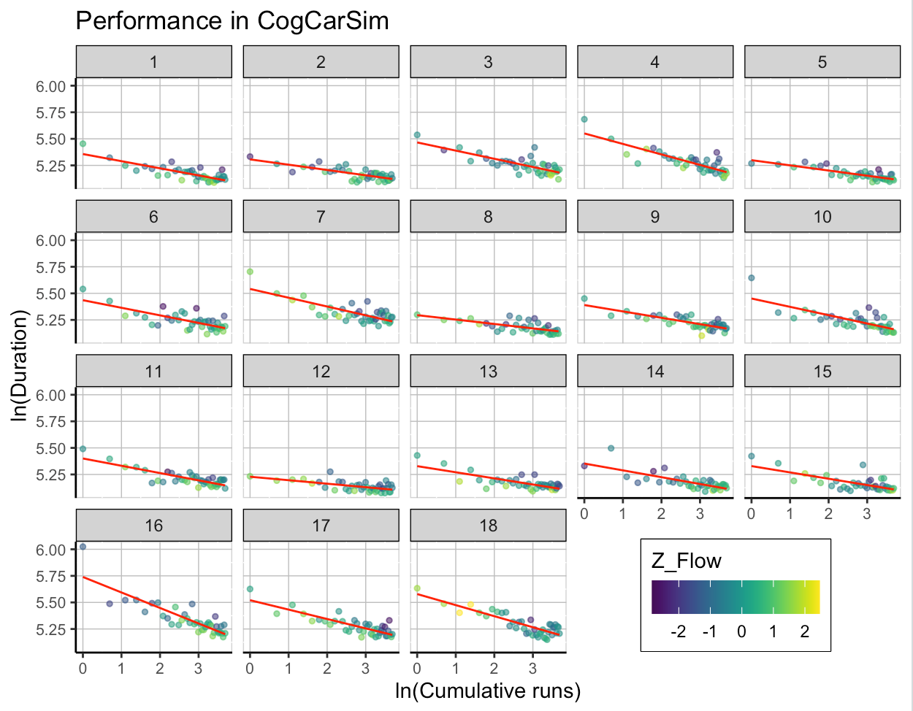

# Week 6

```{r message=FALSE, warning=FALSE}
library(ggplot2)
library(tidyverse)
```


## Exercise 1

The data frames df_w and df_f represent repeated measures data from 60 participants. Variables F1-F3 and W1-W3 are "sub-variables" that will be used to make two composite variables F_total and W_total, respectively. 

```{r include=F}
# simulating data
set.seed(1)
df_f <- data.frame(id = rep(1:60, each = 2) %>% as.character,
                 session = rep(2:1, 60),
                 group = rep(1:2, each = 60),
                 F1 = sample.int(4, 120, replace = T) - 1,
                 F2 = sample.int(4, 120, replace = T) - 1,
                 F3 = (sample.int(4, 120, replace = T) - 1)) %>%
  mutate(F3 = F3*(session-1), F2 = F2*(group-1)*(2-session)) %>%
  mutate(group = factor(group))

df_w <- data.frame(id = rep(1:60, each = 2) %>% as.character,
                 session = rep(1:2, 60) %>% factor,
                 group = rep(1:2, each = 60) %>% factor,
                 W1 = sample.int(4, 120, replace = T) - 1,
                 W2 = sample.int(4, 120, replace = T) - 1,
                 W3 = sample.int(4, 120, replace = T) - 1)
```

### 1.1

Merge the two data frames together.

```{r message=FALSE, warning=FALSE}
df <- full_join(df_w, mutate(df_f, session = as.factor(session)))
head(df)
```

### 1.2

Using the merged data frame, create the **composite variables F_total and W_total, which are the sums of F1-F3 and W1-W3, respectively** (i.e. their values can range from 0 to 9).

```{r}
df <- df %>% mutate(F_total = F1+F2+F3, W_total = W1+W2+W3)
head(df)
```


## Exercise 2

### 2.1

Visualise the distributions of F_total and W_total for the two groups and measurement sessions (for example as boxplots). 

```{r, fig.width = 6}
df %>% gather(key = "key", value = value, 10:11) %>%
  ggplot(aes(x=session, y = value, fill = group)) +
  geom_violin(width = 0.5)+
  geom_boxplot(width=0.1, color="black", show.legend = FALSE, position = position_dodge(width = 0.5)) +
  facet_wrap(~key) +
  theme_minimal() +
  coord_fixed(1/5)
```
It is quite nice to combine the violin and box plots. This gives good overall picture of the distribution of the data. As the data was simulated, it is not clear should we compare groups or sessions i.e. which values should be used for 'x' and 'fill'. Luckily, it would be trivial to change those.

This also got me thinking is there a way to use patterns instead of colors for the fill. Main reason is that even nowadays some journals do not accept color pictures. So let's flip 'x' and 'fill' and try to use patterns.

Apparently, 'ggpattern' package is needed, so let's first install and import that.


```{r message=FALSE, warning=FALSE}
#remotes::install_github("coolbutuseless/ggpattern")
library(ggpattern)
```

```{r, fig.width = 6}
df %>% gather(key = "key", value = value, 10:11) %>%
  ggplot(aes(x=group, y = value)) +
  geom_violin_pattern(aes(pattern = session)) +
  facet_wrap(~key) +
  theme_bw(18) +
  theme(legend.key.size = unit(1, "cm")) +
  coord_fixed(1/5)
```
Maybe not as nice as with the colors, but clear enough and usable. Also, I did not include box plot as the boxes would clas with the violin patterns.

### 2.2

Fit a linear regression model with F_total as the DV, and session and group as predictors.  

```{r}
fit <- lm(F_total ~ session+group, data = df)
summary(fit)
```

### 2.3

Look at the means of F_total by group and session. How are they linked to the linear regression model coefficients?

First compute the means.
```{r}
gm <- df %>% group_by(group) %>% summarise(meanF = mean(F_total))
gm
```

```{r}
sm <- df %>% group_by(session) %>% summarise(meanF = mean(F_total))
sm
```
Looks like the difference between means are close to the coefficients of the fit. Let's check that.

```{r}
cat("Diffrenece between group means: ", as.double(gm[2,2] - gm[1,2]), 
    "\nDiffrenece between session means: ", as.double(sm[2,2] - sm[1,2]))
```
Yep!

## Exercise 3

Visualise the [anscombe dataset](https://rdrr.io/r/datasets/anscombe.html) using ggplot2.

```{r}
library(cowplot)

p1 <- anscombe %>% ggplot(aes(x1, y1)) + geom_point() + geom_smooth(method="lm") + theme_minimal()
p2 <- anscombe %>% ggplot(aes(x2, y2)) + geom_point() + geom_smooth(method="lm") + theme_minimal()
p3 <- anscombe %>% ggplot(aes(x3, y3)) + geom_point() + geom_smooth(method="lm") + theme_minimal()
p4 <- anscombe %>% ggplot(aes(x4, y4)) + geom_point() + geom_smooth(method="lm") + theme_minimal()

plot_grid(p1, p2, p3, p4)
```


## Exercise 4

Not sure if I'll do this as I do not have suitable data for the final assignment. I might do something with concept maps and networks as I might to do that as part of one project. In any case, below is the alternative final assignment.

# Alternative Final Assignment

Alternative final assignment was to reproduce the following picture:


There are some additional instruction, but I thought it might be fun to try to reproduce this first without them. Clearly, facets are for the participants, plots are scatter plots with runs on the x-axis and duration of each run on y-axis, the points are colored with (normalized?) flow values using viridis palette and there is red trend line without the confidence band. Theme is probably the bw and there is custom placement for the legend that also has border. I do not remember if the legend border is part of theme_bw or do it need to be set manually.

```{r message=FALSE, warning=FALSE}
library(viridis)
```

Let's begin by importing the data and have look at it.
```{r message=FALSE, warning=FALSE}
fss <- read_csv("fss_learning.csv")
summary(fss)
```
Looking at 'flow' is is now clear that the values are normalized. To normalize the flow values let use z-scores: $z = \frac{x-\mu}{\rho} = \frac{x-mean(x)}{sd(x)}$ 
Let's plot it! After few trialn and tweaks this is the result.
```{r message=FALSE, warning=FALSE}
meanZ = mean(fss$flow, na.rm = TRUE)
sdZ = sd(fss$flow, na.rm = TRUE)

fss %>% ggplot(aes(x = log(cumrun), y = log(duration), color = (flow-meanZ)/sdZ)) +
  geom_point(alpha = 0.5) +
  geom_smooth(method = "lm", formula = y~x, color = "red", se = FALSE)+
  facet_wrap(~participant) +
  scale_color_viridis(name = "Z_Flow", guide = guide_colorbar(direction = "horizontal", title.position = "top"), breaks = c(-2,-1,0,1,2)) +
  theme_bw() +
  labs(
    title = "Performance in CogCarSim",
    x = "ln(Cumulative runs)",
    y = "ln(duration)"
  ) +
  theme(
    legend.position = c(0.9, -0.05),
    legend.justification=c(1,0),
    legend.box.background = element_rect(colour = "black")
  )
```
I think it is close, but let's check the instructions. Did not realize that the z_scores were participant wise. Let's compute those and use those for the plot.

```{r}
fss <- fss %>% group_by(participant) %>% mutate(Z_Flow = (flow-mean(flow, na.rm = TRUE))/sd(flow, na.rm = TRUE)) %>% ungroup()
head(fss)
```

```{r message=FALSE, warning=FALSE}
fss %>% ggplot(aes(x = log(cumrun), y = log(duration), color = Z_Flow)) +
  geom_point(alpha = 0.5) +
  geom_smooth(method = "lm", formula = y~x, color = "red", se = FALSE)+
  facet_wrap(~participant) +
  scale_color_viridis(guide = guide_colorbar(direction = "horizontal", title.position = "top")) +
  theme_bw() +
  labs(
    title = "Performance in CogCarSim",
    x = "ln(Cumulative runs)",
    y = "ln(Duration)"
  ) +
  theme(
    legend.position = c(0.9, -0.05),
    legend.justification=c(1,0),
    legend.box.background = element_rect(colour = "black")
  )
```

Now it really is as close as possible. To make it identical would require tweaking image size, legend position etc.

I think, it is possible to make it bit more better. Firstly, as the points are colored by the z-scores it is better to use diverging color map. Similarly, I think the red line is bit too strong and distracting.

For the color map I'll use the cool-warm color map from Moreland K. (2009) Diverging Color Maps for Scientific Visualization. In: Bebis G. et al. (eds) Advances in Visual Computing. ISVC 2009. Lecture Notes in Computer Science, vol 5876. Springer, Berlin, Heidelberg. https://doi.org/10.1007/978-3-642-10520-3_9

```{r message=FALSE, warning=FALSE}
fss %>% ggplot(aes(x = log(cumrun), y = log(duration), color = Z_Flow)) +
  geom_point(alpha = 0.9) +
  geom_line(stat = "smooth", method = "lm", formula = "y ~ x", color = "black", alpha = 0.5)+
  facet_wrap(~participant) +
  scale_color_gradient2(low="#b40426", mid="#dddddd", high="#3b4cc0", guide = guide_colorbar(direction = "horizontal", title.position = "top")) +
  theme_minimal() +
  labs(
    title = "Performance in CogCarSim",
    x = "ln(Cumulative runs)",
    y = "ln(Duration)"
  ) +
  theme(
    legend.position = c(0.9, -0.05),
    legend.justification=c(1,0)
  )
```

In my humble opinion this looks better than the original. Mainly, I think that the diverging color map makes interpreting the plot clearer as it is easier to differentiate the values below or above zero. I choose to use red for negative values as it feels bit more intuitive for the context. Similarly the black line does not clash some much with the points. Also, using the minimal theme makes the overall looks bit crispier.

